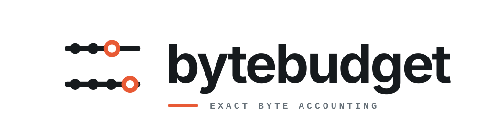

<p align="center">
  
</p>

<p align="center"><strong>Exact byte accounting for bounded systems.</strong></p>

<p align="center">
  A tiny, deterministic vocabulary for retained-storage charges and bounded
  capacity accounting.
</p>

<p align="center">
  <a href="#install">Install</a>
  <span> · </span>
  <a href="#use">Use</a>
  <span> · </span>
  <a href="#model">Model</a>
  <span> · </span>
  <a href="#contract">Contract</a>
  <span> · </span>
  <a href="#scope">Scope</a>
</p>

<br />

## Install

```toml
[dependencies]
bytebudget = "=0.0.1-rc.1"
```

## Use

```rust
use bytebudget::{ByteBudget, ByteCount};

fn main() {
    let mut budget = ByteBudget::new(ByteCount::new(1_024));
    let charge = ByteCount::new(256);

    budget
        .try_reserve(charge)
        .expect("the budget has enough capacity");
    assert_eq!(budget.available(), ByteCount::new(768));

    budget.release(charge).expect("the charge is in use");
    assert_eq!(budget.used(), ByteCount::ZERO);
}
```

## Model

| Type | Purpose |
| --- | --- |
| `ByteCount` | Fixed-width byte quantity with checked arithmetic |
| `Retained` | Consumer-defined retained-storage measurement |
| `ByteBudget` | Aggregate use beneath an immutable limit |

Conversions use `ByteCountOverflow`, capacity rejection uses
`CapacityExceeded`, and accounting underflow uses `OverRelease`.

<a id="the-accounting-unit-is-u64"></a>
<a id="measurement-happens-once"></a>
<a id="charge-lifetime-and-provenance"></a>
<a id="budget-operations-are-transactional"></a>

## Contract

`ByteCount` uses `u64` on every target. `Retained` values are measured at
admission and never remeasured during release. Growth first reserves its added
charge and updates the stored charge transactionally. `ByteBudget` keeps
`used <= limit`; rejected reservations and releases leave it unchanged.

The complete contracts cover
[retained charges](https://github.com/zsumz/bytebudget/blob/main/docs/retained-charges.md)
and
[accounting operations](https://github.com/zsumz/bytebudget/blob/main/docs/accounting-contract.md).

## Scope

`bytebudget` is `no_std`, allocation-free, dependency-free, feature-free, and
contains no unsafe code. It does not inspect allocators, parse byte units,
perform I/O, synchronize budgets, track reservation identities, change limits,
or choose eviction and backpressure policy.

## Qualification

```sh
zcheck run check
```

See the full
[qualification contract](https://github.com/zsumz/bytebudget/blob/main/docs/qualification.md).

## Version policy

The minimum supported Rust version is 1.88 and the qualification graph executes
it directly. MSRV increases are compatibility changes. Before 1.0, releases may
deliberately refine the public API; use an exact version pin when evaluating a
release candidate.

## License

The crate is Apache-2.0 licensed. See [LICENSE](LICENSE). The logo embeds Space
Grotesk under the SIL Open Font License 1.1; see
[LICENSES/Space-Grotesk-OFL.txt](LICENSES/Space-Grotesk-OFL.txt).
